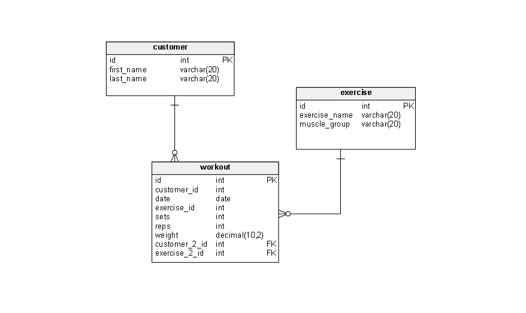

# Fitness Tracker API

A RESTful API built with Spring Boot for managing workouts, exercises, and customers. This project serves as a simple backend for a fitness tracking system.

## 🧱 Project Structure

- **Controller** – Exposes REST API endpoints (`WorkoutController`)
- **Service** – Contains business logic (e.g., creating/updating workouts)
- **Persistence** – JPA entities and repositories for database access
- **DTO & Mapper** – Used for data transfer and conversion between layers
- **Resources** – SQL scripts (`schema.sql`, `data.sql`) for DB initialization

## Database Structure



## 🧪 API Endpoints

- `GET /api/workouts` – Retrieve all workouts
- `GET /api/workouts/{id}` – Retrieve a specific workout by ID
- `POST /api/workouts` – Create a new workout
- `PUT /api/workouts/{id}` – Update an existing workout
- `DELETE /api/workouts/{id}` – Delete a specific workout by ID

## ▶️ How to Run

1. Make sure you have the following installed:
    - Java 17+
    - Gradle
    - (Optional) Docker + PostgreSQL

2. Start the application:
```bash
./gradlew bootRun
Access the API at: http://localhost:8080/api/workouts

🗄️ Database
The project uses SQL scripts (schema.sql and data.sql under resources/) to initialize the database. Spring Boot will automatically run these on startup if properly configured.

Default DB: H2 (can be switched to PostgreSQL or others via configuration)

🛠 Technologies Used
Java 17

Spring Boot

Spring Data JPA

RESTful APIs

H2 / PostgreSQL

Gradle

📌 Notes
This is a backend-only application; no frontend is included.

Suitable as a starting point for a full-stack fitness tracking system.

👨‍💻 Author
Developed for learning or development purposes. Feel free to fork and modify as needed.
